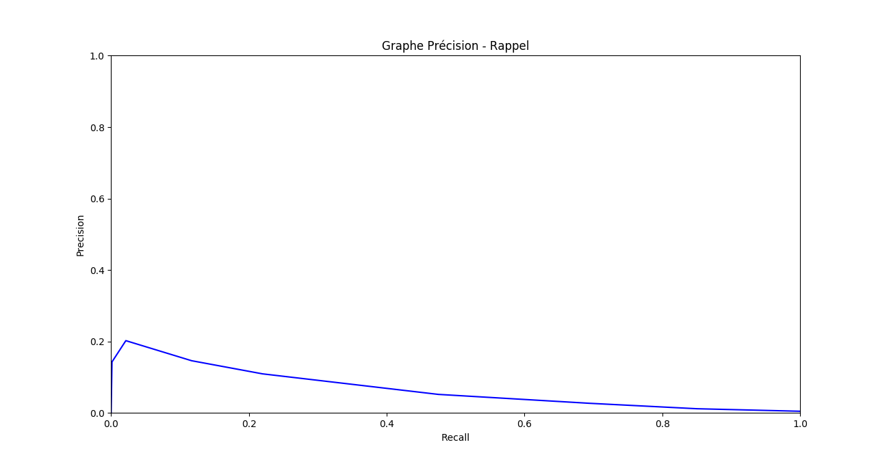

# Get_zat : notre projet de recherche d'informations

_Auteurs : Erwan de Kergaradec et Charles de la Roche Saint André_

## Introduction

Vous trouverez dans ce `ReadME` l'ensemble de nos résultats concernant notre projet scolaire de "Fondements à la recherche d'informations". Ce premier projet a pour objectif de mettre en œuvre les notions fondamentales d’indexation et de
modèles de recherche vues en cours par la réalisation d’un petit moteur de recherche ad-hoc. Il s'appuie sur la base statique de documents textuels CACM contenant un ensemble de corpus, questions et réponses associées.  
Chacune des parties ci-dessous détaille le contenu de nos fichiers `.py` ainsi que les rôles respectifs de nos fonctions.  
La dernière partie explique comment lancer notre code pour retrouver les mêmes résultats et faire vos propres recherches sur le corpus CACM.

## Lecture des datasets

Toutes les fonctions de lecture des datasets sont présentes dans notre fichier `file_manager.py`.  
Elles nous permettent de lire nos datasets de documents, questions et réponses associées et de stocker les informations sous forme de dictionnaires python dont : 
- les clefs sont les identifiants des documents, questions et réponses
- les valeurs sont les données textuelles associées à chaque document, question, réponse

Voici les différentes informations recoltées sur les collections :
- collection de documents : **3204 documents**
- collection de questions : **64 questions**
- collection de réponses : **52 réponses**

## Traitement linguistique

Les fonctions filtrant nos données linguistiques se situent dans le fichier `nlp_processing.py`.  
Elles nous permettent de : 
- tokeniser nos textes
- supprimer les chiffres
- supprimer les mots communs
- raciniser les mots

Une fois notre collection de documents tokenisée, nous trouvons les informations suivantes :
- nombre de tokens de notre collection : **108 113 tokens**
- graphe de la fréquence (f) vs rang (r) pour tous les tokens de la collection :

## Indexation

La construction de notre index inversé a lieu dans le fichier `browser.py` au sein de la fonction `build_index_inv`.  
Notre index inversé est un dictionnaire dont :
- les clefs sont les tokens de notre collection de documents
- les valeurs sont des dictionnaires dont:
  - les clefs sont les identifiants de nos documents contenant le token
  - les valeurs sont les fréquences d'apparition du token dans le document en question
  
Nous avons pu déterminer de cet index inversé la taille de notre vocabulaire : **5405 tokens**.
 

## Moteur de recherche booléen

Nous avons mis en place un modèle de recherche booléen (`boolean_request`) présent dans le fichier `browser.py`.  
Ce modèle de recherche se base sur une requête contenant deux mots clefs et un opérateur.  
Assez basiquement, on prétraite nos deux mots de la même manière que notre collection de documents, puis on regarde quels documents contiennent le premier mot et quels documents contiennent le second mot.  
Ensuite, en fonction de l'opérateur (AND, OR, NOT), on renvoie la liste triée de documents correspondants à notre requête booléenne.

## Modèle de recherche vectoriel

Nous avons ensuite mis en place un modèle de recherche plus élaboré (le modèle vectoriel `compute_vectors`), également présent dans le fichier `browser.py`. Ce modèle fait appel à plusieurs classes se trouvant dans le fichier `vectorizers.py` et correspondant aux pondérations évoquées ci-dessous.  
Il s'agit ici de vectoriser chaque phrase dans une représentation de tout le vocabulaire de notre corpus. La dimension de chaque vecteur correspond donc à la taille du vocabulaire.  

### Pondération booléenne
 
Dans le cas de la pondération booléenne, la vectorisation est assez simple : le vecteur d'un document contient un 1 dans la colonne _i_ si le mot représenté par la colonne _i_ est contenu dans ce document, sinon cela vaut 0.
La requête est vectorisée de la même manière. On peut alors cacluler une distance de similarité entre chaque document et la requête ce qui permet de renvoyer tous les documents 'proches' de la requête.

### Pondération tf-idf

Cette fois-ci le poids associé à la colonne _i_ est différent : on calcule la fréquence d'apparition du mot représenté par la colonne _i_ dans chaque document ainsi que sa fréquence d'apparition dans tout le corpus.  
Cela permet d'accorder moins d'importance aux mots très présents dans le corpus et se focaliser sur les mots-clés.  
La requête peut ici est vectorisée selon la méthode booléenne ou tf-idf.   
On peut donc encore calculer une distance de similarité entre ces vecteurs.  

### Pondération tf-idf normalisée

Au sein de cette méthode de pondération, il s'agit de reprendre la pondération tf-idf mais on normalise chaque vecteur.  

### Pondération fréquence normalisée

Dans ce cas, on calcule encore la fréquence du mot représenté par la colonne _i_ mais on divise cette valeur par la fréquence maximale pour chaque doc_id, ce qui assure également des poids compris entre 0 et 1 mais propose une variante.  

## Evaluation pour la collection CACM

Afin d'évaluer la collection CACM, nous avons d'abord réalisé un apprentissage sur cette collection (en choisissant un type de vectorisation).  
Nous nous sommes servis des fichiers query.txt et qrels.txt afin de tester notre moteur de recherche ainsi entrainé.  
Il s'agit de prédire les documents pertinents pour chaque requête de query.txt et de le comparer aux réponses du fichiers qrels.txt. Ceci nous permet de calculer la précision et le rappel pour un seuil de similarité fixé.

Afin de tracer le graphe Précision-Rappel ci-dessous, nous avons fait varier le seuil de similarité (faisant ainsi varier le degré de précision du moteur de recherche).
Voici le graphe obtenu : 

## Expérimentez-vous même !

